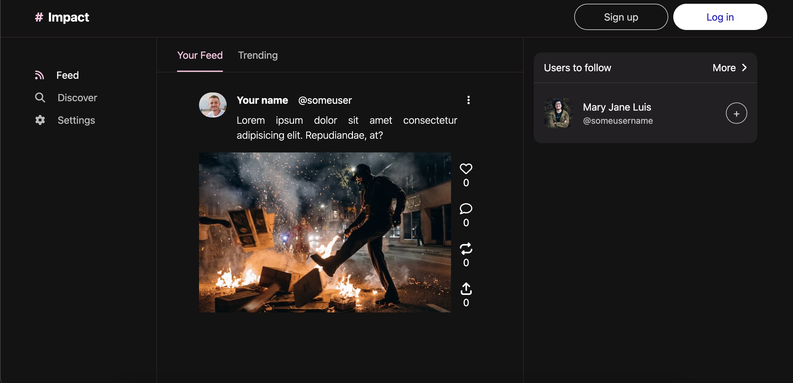
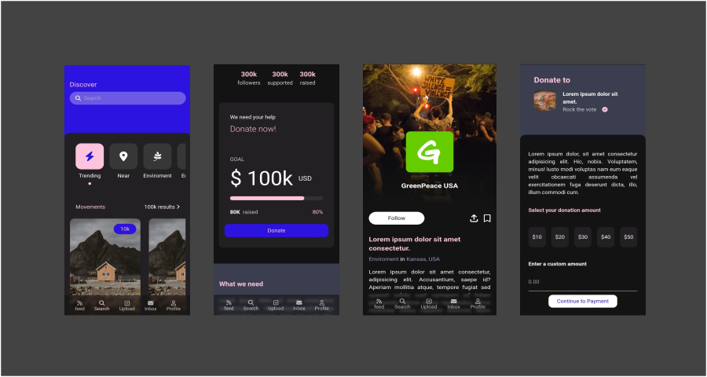

## Impact
A social network app made with Django. Inspired by [Behance](https://www.behance.net/gallery/139934827/Humanified-Simplifying-digital-activism?tracking_source=search_projects%7Csocial+network+design). It implements the mainly functionalities of a common social network: login, signup, posts creation, post edition, comments, post shares, likes, stories, etc. It includes a little chat made with `channels` and websockets.


### 📦 Installation
1. First, clone the respository:
```
git clone https://github.com/jsonfm/impact-django.git
```
2. After, create a virtual enviroment:
```
python3 -m venv venv
```
3. Then, install the dependencies:
```
source venv/bin/activate
pip install -r requirements.txt
```

### 🚀 Django
```
python manage.py run server
```

### 🎨 Tailwind
This project uses node for bundle styles.
```
cd tailwind
npm run tw:build
```

### 📁 Structure

```
.
├── apps
│   ├── auth
│   └── feed
├── impact
├── media
├── static
│   ├── css
│   └── js
├── tailwind
└── templates
    ├── auth
    ├── feed
    └── layout

```

### 📄 Commands

Create a super user:
```
python manage.py createsuperuser
```

Migrate:
```
python manage.py migrate
```

Make migrations:
```
python manage.py makemigrations
```